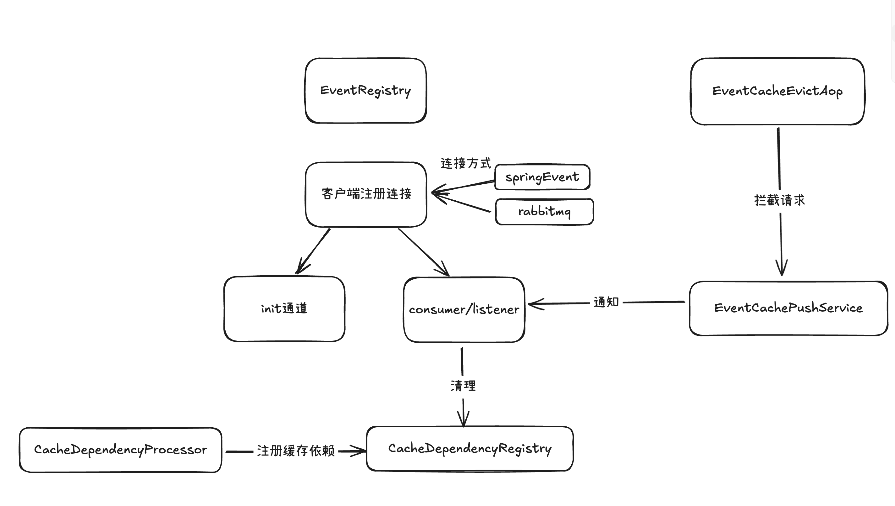

## Cache Event

### 项目简介

Cache Event 是一个基于 Spring Boot 的分布式缓存事件管理框架，旨在解决分布式系统中缓存一致性问题。该项目提供了灵活的缓存清除机制，支持通过事件驱动的方式在分布式环境中同步清除缓存，确保各节点间缓存数据的一致性。

### 技术栈

- **核心语言**: Java 11
- **框架**: Spring Boot 2.6.5, Spring AMQP
- **缓存技术**: Caffeine, Redis
- **消息队列**: RabbitMQ
- **构建工具**: Maven
- **其他技术**: AOP, Spring Cache, 注解处理

### 项目结构

### 核心功能

#### 1. 多种事件推送机制
- **Spring Event**: 基于 Spring 内部事件机制，适用于单体应用
- **RabbitMQ**: 基于 RabbitMQ 消息队列，适用于分布式环境

#### 2. 缓存依赖管理
- 通过 @CacheDependency 注解定义缓存间的依赖关系
- 自动维护缓存依赖图谱，支持递归清除依赖缓存
- 提供内存和 Redis 两种依赖关系存储实现

#### 3. 自动化缓存清除
- 拦截 `@CacheEvict` 注解方法，自动发布缓存清除事件
- 支持基于事件的缓存清除监听和处理
- 动态注册 RabbitMQ 队列和监听器

#### 4. 灵活的配置机制
- 支持通过配置文件切换事件推送方式
- 可扩展的架构设计，易于添加新的事件推送机制

### 核心组件

#### cache-event-common
提供基础注解和工具类：
- @CacheDependency: 定义缓存依赖关系
- InetAddressUtil: IP 地址获取工具

#### cache-event-core
核心功能模块：
- 缓存事件发布与监听机制
- 缓存依赖注册与管理
- AOP 拦截缓存清除操作
- Spring Event 推送实现

#### cache-event-rabbit-mq
RabbitMQ 扩展模块：
- RabbitMQ 队列动态创建与管理
- 消息监听器构建与注册
- RabbitMQ 消息推送实现

### 项目亮点

1. **无侵入式设计**: 通过 AOP 和注解方式实现，业务代码无需修改
2. **高可扩展性**: 模块化设计，支持多种事件推送机制
3. **分布式支持**: 基于 RabbitMQ 实现跨节点缓存同步
4. **智能依赖管理**: 自动维护缓存依赖关系，支持递归清除
5. **灵活配置**: 支持运行时切换事件推送方式

### 应用场景

- 微服务架构下的缓存一致性管理
- 分布式系统中跨服务的缓存清除
- 复杂业务场景下的缓存依赖管理
- 需要保证数据最终一致性的系统

### 项目价值

该框架有效解决了分布式系统中的缓存一致性难题，通过事件驱动机制实现缓存的自动同步清除，大大降低了系统维护成本，提升了数据一致性保障水平。同时，其模块化设计使得系统具有良好的可扩展性和维护性。